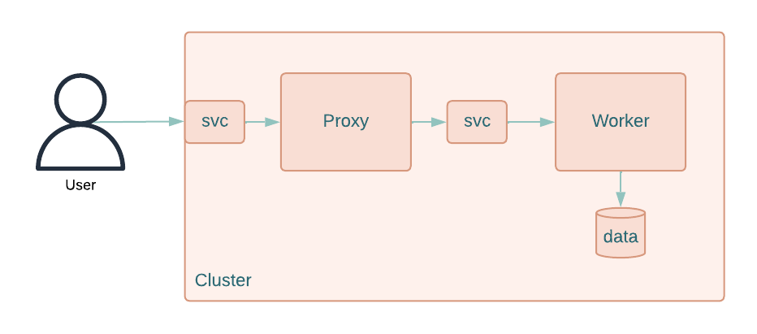

## About
This project contains all the Kubernetes manifests to deploy de following application:


## Usage
Deploy the whole application using a single command:
```sh
kubectl apply -f .
```
Then access the swagger exposed by Proxy application using this url _http://localhost:30000/docs_